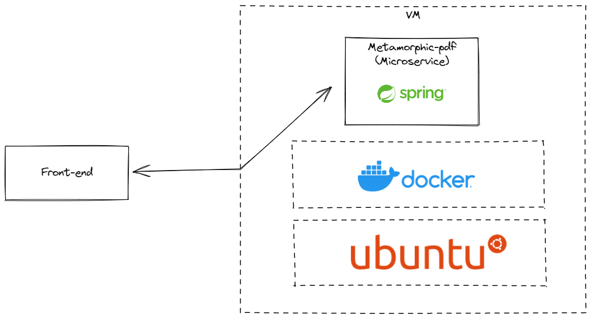

# metamorphic-pdf

Serviço para manipulação de PDF's. Utilizado no meu projeto de TCC (Doc Easy).

## Descrição 🧑🏼‍🏫

Microsserviço responsável por realizar a junção dos documentos PDF.

## Tecnologias ⚙️

- Java
- Spring Boot
- PdfBox

## Topologia

